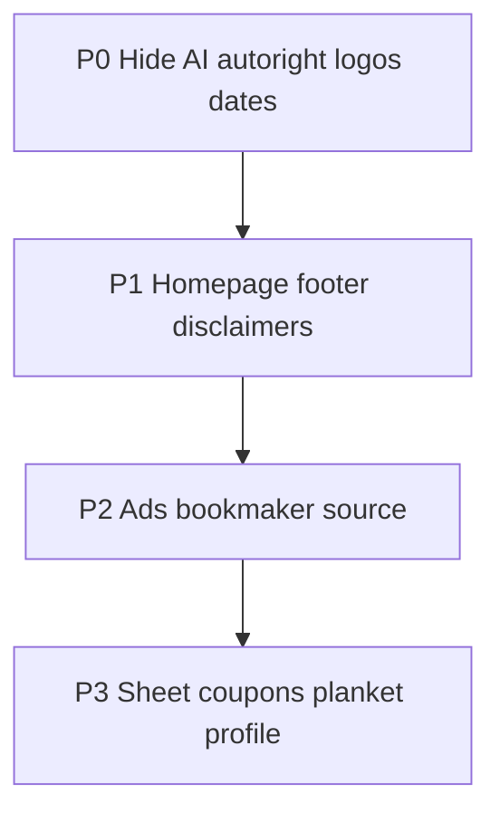

# Feedback prompt-deck — Spelbok

Källa: `Feedback spreadsheet (1).pdf` + möteshistorik (2026).  
Leverans: copy-paste-klara Cursor-prompts. **Bygg endast det som prompten säger — inget mer.**

---

## Hur du använder

1. Kör **en prompt per Cursor-chatt** (Agent-läge).
2. Följ prioritetsordning P0 → P1 → P2 → P3.
3. Klistra in hela blocket under `cursor-prompt` (inklusive kontext och acceptanskriterier).
4. Efter varje paket: manuell smoke-test enligt acceptanskriterierna innan nästa.
5. Läs `AGENTS.md` / Next.js-docs i `node_modules/next/dist/docs/` innan API-ändringar.

---

## Beslutade regler (möte överstyr PDF där de skiljer sig)

| Ämne | Regel |
|------|--------|
| Radera bokfört spel | Tillåtet **före avspark**, oavsett låst/olåst. **Förbjudet efter** avspark. |
| Void | Används när spel lagts fel — behandlas som återbetalning (stake tillbaka). |
| AI-rekommendationer | **Pausa / dölj** i fas 1. Bygg inte vidare. |
| Auto-rättning | **Dölj / stäng av** tills vidare. |
| Design / färg / logga | Bestäms senare — bygg inte ny palett i dessa prompts. |
| Kuponger | Redaktionella, **inte** kopplade till användarens spreadsheet. |
| Textändringar | Separat Excel (bilaga A); label-byten som nämns i prompts ska ändå göras i kod. |

---

## Prioritetsordning

| Prio | Promptar | Fokus |
|------|----------|--------|
| **P0** | 01–05 | Dölj AI + auto-rätt; logo-/datumbuggar; label Kommentar |
| **P1** | 06–08 | Startsida, footer, disclaimers |
| **P2** | 09–10 | Annonser, enhetlig spelbolagskälla |
| **P3** | 11–21 | Sheet, kuponger, sök, planket, profil, performance, import |
| **Bilagor** | A–C | Textlista, manuella leveranser, fas 2 AI (bygg inte) |



---

# P0 — Snabbvinster / synliga buggar

## Prompt 01 — Dölj AI-rekommendationer (P0)

**Mål:** Pausa AI-rekommendationsfunktionen i UI tills fas 2. Ingen ny rekommendationslogik.

**Kontext:** `src/app/(app)/hem/page.tsx`, `src/components/suggestions/MatchesForYou.tsx`, `src/components/suggestions/DailySuggestions.tsx`, `src/lib/suggestions.ts`

**Krav:**
- Dölj/ta bort rendering av MatchesForYou / DailySuggestions på hem och andra synliga ytor.
- Cron/edge får gärna fortsätta i bakgrunden om det är enklare — men användaren ska inte se rekommendationer.
- Inga premium-/paywall-ändringar.

**Acceptanskriterier:**
- [ ] Inloggad hem visar inte AI-/förslag-sektion.
- [ ] Inga trasiga imports eller dead UI-länkar kvar synliga.

**Gör inte:** Bygg inte om signalmotorn; implementera inte 19 kr/mån.

````cursor-prompt
Du arbetar i Spelbok (Next.js App Router + Supabase).

Uppgift: Pausa AI-rekommendationer i fas 1 genom att dölja dem i UI.

Gör:
1. Hitta alla ställen där MatchesForYou, DailySuggestions eller liknande förslag renderas (börja med src/app/(app)/hem/page.tsx och src/components/suggestions/).
2. Dölj sektionerna så de inte syns för användaren (ta bort render eller feature-flagga av — välj enklast som är enkelt att slå på igen i fas 2).
3. Lämna backend/cron orörd om det inte krävs för att undvika fel; användaren ska bara inte se UI.

Acceptans:
- Inloggad /hem visar ingen AI-rekommendationssektion.
- Inga console/build-fel p.g.a. oanvända imports.

Gör inte: bygg inte ny rekommendationslogik, paywall eller premium.
````

---

## Prompt 02 — Dölj / stäng av auto-rättning (P0)

**Mål:** Användaren och synliga flöden ska inte auto-rätta spel tills vidare.

**Kontext:** `src/hooks/useLiveFixtures.ts`, `src/lib/settle-open.ts`, `src/lib/refresh-live.ts`, `supabase/functions/settle-bets/index.ts`, `src/app/admin/sattling/page.tsx`, `src/components/admin/SettleAdmin.tsx`, `src/lib/admin/settle.ts`

**Krav:**
- Stäng av klientdriven auto-rättning (t.ex. i `useLiveFixtures`).
- Pausa eller dokumentera tydligt i admin att automatisk sättling är avstängd; manuell sättling får finnas kvar.
- Edge `settle-bets` ska inte köra automatiskt mot produktion utan explicit admin-körning (eller var tydlig i kod/kommentar + kill-switch).

**Acceptanskriterier:**
- [ ] Öppna spel rättas inte automatiskt när match går FT i UI.
- [ ] Manuell rättning via sheet/admin fungerar fortfarande.
- [ ] En tydlig plats att slå på auto-rätt igen senare.

**Gör inte:** Ta inte bort hela sättlingsmodellen (win/loss/void/push).

````cursor-prompt
Du arbetar i Spelbok (Next.js + Supabase).

Uppgift: Dölj/stäng av automatisk rättning tills vidare (feedbackkrav).

Gör:
1. Kartlägg auto-rättningsvägar: src/hooks/useLiveFixtures.ts, src/lib/settle-open.ts, src/lib/refresh-live.ts, supabase/functions/settle-bets/, admin under src/app/admin/sattling/.
2. Stäng av klient-auto-rätt så FT/live inte sätter resultat automatiskt.
3. Säkerställ att manuell sättling (SheetSettleControls / admin) fortfarande fungerar.
4. Lägg en tydlig kill-switch eller kommentar + flagga så funktionen enkelt kan återaktiveras.

Acceptans:
- Spel auto-rättas inte längre i normal UI-användning.
- Manuell win/loss/void/push fungerar.
- Ingen regression i push-notiser för manuellt satta resultat (om de finns).

Gör inte: radera settle-modellen; bygg inte ny AI.
````

---

## Prompt 03 — Lag- och ligalogotyper i kuponger och bokning (P0)

**Mål:** Lagens och ligornas loggor ska visas korrekt i spreadsheet, bokningsflöde och kuponger.

**Kontext:** `src/lib/logos.ts`, `src/components/bets/TeamPair.tsx`, `src/components/bets/LeagueLogo.tsx`, `src/components/bets/SheetMatchCell.tsx`, `src/components/coupons/CouponCard.tsx`, `src/components/bets/FixturePicker.tsx`, `src/components/bets/BetForm.tsx`

**Krav:**
- Fixa trasiga/saknade team- och league-logos i sheet, vid bokning och på kupongkort.
- Använd befintlig logokälla (`logos.ts` / API-Sports-cache) — hitta rotorsak (fel URL, saknad join, CSS som gömmer, etc.).

**Acceptanskriterier:**
- [ ] Spreadsheet visar lag- och ligalogor när data finns.
- [ ] Boknings-UI visar logor för valda matcher.
- [ ] Kupongkort visar laglogor konsekvent.
- [ ] Graceful fallback (initialer/placeholder) om logo saknas — ingen trasig bildikon utan fallback.

**Gör inte:** Byt inte logo-CDN i onödan; rör inte annonser.

````cursor-prompt
Du arbetar i Spelbok.

Uppgift: Fixa bugg där lagets och ligans loggor inte visas korrekt i kuponger och vid bokning/spreadsheet.

Relevanta filer:
- src/lib/logos.ts
- src/components/bets/TeamPair.tsx
- src/components/bets/LeagueLogo.tsx
- src/components/bets/SheetMatchCell.tsx
- src/components/coupons/CouponCard.tsx
- FixturePicker / BetForm

Gör:
1. Reproducera: sheet, bokningsmodal, kuponglista/detalj.
2. Hitta rotorsak (saknad data, fel path, broken img, CSS).
3. Fixa så loggor renderas när API/DB har URL; annars tydlig fallback.
4. Verifiera både desktop och mobil layout.

Acceptans:
- Loggor syns där match/lag/liga visas när data finns.
- Inga layoutbrott; fallback om saknad logo.

Gör inte: redesigna kortvy eller annonser i samma PR.
````

---

## Prompt 04 — Datumkolumn = matchavspark (P0)

**Mål:** Datum i spreadsheet ska visa matchens avspark, inte när spelet loggades.

**Kontext:** `src/components/bets/SheetBetsTable.tsx` (använder idag ofta `placed_at`), `src/components/bets/SheetMatchCell.tsx`, `src/components/bets/LoggedBeforeKickoff.tsx`, `src/lib/live-fixture.ts`

**Krav:**
- Datumkolumn / primärt synligt datum = fixture kickoff (timezone Stockholm om det är appstandard).
- Behåll eventuellt “bokfört”-info sekundärt om det redan finns UI för det — men kolumnen som användaren ser som “datum” ska vara avspark.
- Kortvy ska följa samma regel.

**Acceptanskriterier:**
- [ ] Tabellvy: datum = avspark.
- [ ] Kortvy: samma.
- [ ] Sortering efter datum följer avspark om sort är datumbaserad (eller dokumentera undantag).

**Gör inte:** Ändra inte `placed_at`-lagring; bara presentation (och sort om nödvändigt).

````cursor-prompt
Du arbetar i Spelbok.

Uppgift: Ändra datumkolumnen i spreadsheet så matchens avspark visas istället för när spelet loggades.

Relevanta filer:
- src/components/bets/SheetBetsTable.tsx
- src/components/bets/SheetMatchCell.tsx
- src/components/bets/SheetBetCards.tsx
- src/lib/live-fixture.ts / fixture-fält på bet

Gör:
1. Identifiera var placed_at / created_at visas som “datum”.
2. Byt primär visning till fixture kickoff (samma tz som resten av appen, troligen Europe/Stockholm).
3. Uppdatera kortvy konsekvent.
4. Om tabellen sorterar på datum: sortera på kickoff.

Acceptans:
- Användaren ser avsparkstid som datum.
- Inga NaN/Invalid Date när fixture saknas — visa fallback (t.ex. “—” eller placed_at med tydlig etikett).

Gör inte: migrera inte historik i DB i denna prompt.
````

---

## Prompt 05 — “Spelrekommendation” → “Kommentar” (P0)

**Mål:** Byt synlig etikett till Kommentar överallt (UI + admin).

**Kontext:** `src/components/coupons/CouponCard.tsx`, `src/components/admin/CouponsAdmin.tsx` (fält `bookmaker_reason`)

**Krav:**
- Alla synliga strängar “Spelrekommendation” → “Kommentar” (casing enligt design: “Kommentar”).
- DB-fältnamn behöver inte bytas.

**Acceptanskriterier:**
- [ ] Inga synliga “Spelrekommendation” i kupong-UI eller admin-formulär.
- [ ] Innehållet i fältet oförändrat.

````cursor-prompt
Du arbetar i Spelbok.

Uppgift: Ändra etiketten "Spelrekommendation" till "Kommentar" i kuponger och admin.

Filer att börja med:
- src/components/coupons/CouponCard.tsx
- src/components/admin/CouponsAdmin.tsx
- Sök globalt efter "Spelrekommendation"

Gör: byt endast synliga labels/strängar. Behåll fältnamn i DB/API.

Acceptans: ingen synlig "Spelrekommendation" kvar; "Kommentar" visas istället.
````

---

# P1 — Startsida + footer + compliance

## Prompt 06 — Startsida cleanup (P1)

**Mål:** Rensa publika startsidan enligt PDF/möte.

**Kontext:** `src/app/(public)/page.tsx`, `src/components/topplista/TopListCard.tsx`, `src/lib/toplists.ts`, `src/components/bets/BookmakersGrid.tsx` / BookmakerCard, AdSlot-användning på home

**Krav:**
- Ta bort / dölj sektion “bokför spel från …” / spelbolagslogor som inte behövs initialt (PDF: “Bokför spel från Unibet”).
- Ersätt live-statistik / inbäddad spreadsheet-box med **statisk mockup-bild** (mobil + desktop) — använd placeholders i `public/` om assets saknas och dokumentera filnamn.
- Ta bort keynotes (siffror typ “31 bokförda spel”, “publika spreadsheets”).
- Hopplistan / topplista: bredda kant-i-kant; ta bort reklambox bredvid (t.ex. Unibet-bonusbox).
- Ta bort “Jämför svenska spelbolag” om den syns på startsidan.
- Annonser: förbered ytor för HTML-banners (själva HTML-innehållet kommer manuellt) — bryt inte AdSlot.

**Acceptanskriterier:**
- [ ] Startsidan saknar keynotes och “bokför från X”-sektion.
- [ ] Statistiksektion är mockup, inte live data.
- [ ] Topplista fullbredd utan sido-bonusbox.
- [ ] Footer oförändrad i denna prompt (görs i 07).

**Gör inte:** Ny färgpalett; bygg inte annonsadmin här.

````cursor-prompt
Du arbetar i Spelbok. Endast publik startsida.

Uppgift: Startsida enligt feedback (PDF + möte).

Fil: src/app/(public)/page.tsx (+ eventuella child-komponenter den importerar).

Krav:
1. Ta bort/dölj "Bokför spel från …" / spelbolags-logosektion som inte behövs initialt.
2. Ersätt live-statistik / inbäddad spreadsheet-preview med statisk mockup (desktop + mobil). Om bilder saknas: lägg rimliga placeholders under public/ och kommentera i PR vilka slutliga assets som behövs.
3. Ta bort keynotes/statistik-siffror (bokförda spel, publika sheets etc.).
4. Bredda hopplistan/topplistan full bredd; ta bort reklambox bredvid.
5. Ta bort "Jämför svenska spelbolag" från startsidan om den finns där.
6. Behåll AdSlot-ytor om de behövs för kommande HTML-banners — ingen vit trasig box.

Acceptans: startsidan matchar kraven ovan på desktop och mobil.

Gör inte: footer (separat prompt), mörkt tema, AI-förslag.
````

---

## Prompt 07 — Footer utökad (P1)

**Mål:** Footer med logga, nav och ansvarsspel-länkar.

**Kontext:** `SiteFooter` i `src/components/layout/SiteHeader.tsx`, `src/app/(public)/layout.tsx`, `src/app/(app)/layout.tsx`

**Krav:**
- Logga till vänster.
- Navigationslänkar: Om oss, Kontakt (länka till befintliga CMS-sidor/slugs om de finns, annars `/om-oss` `/kontakt` och notera).
- Behåll / lägg till: 18+, spela ansvarsfullt, stödlinje.se, spelpaus.se (externa länkar där det är rätt).
- Samma footer-känsla publikt och i app om båda använder SiteFooter.

**Acceptanskriterier:**
- [ ] Footer visar logga + nav + ansvarslänkar.
- [ ] Länkar fungerar (interna 200 / externa korrekta URL:er).

````cursor-prompt
Du arbetar i Spelbok.

Uppgift: Utöka footern.

SiteFooter finns i src/components/layout/SiteHeader.tsx (exporterera hur den används i public/app layouts).

Krav:
- Logga till vänster
- Nav: Om oss, Kontakt
- Ansvar: 18+, spela ansvarsfullt, https://www.stodlinjen.se, https://www.spelpaus.se
- Behåll befintlig stil; utöka innehållet, bygg inte ny designriktning

Acceptans: synlig på publik layout (och app om samma komponent); länkar korrekta; responsiv.

Gör inte: ändra startsidans sektioner (prompt 06).
````

---

## Prompt 08 — Spelbolags-disclaimers överallt (P1)

**Mål:** Standarddisclaimer + valfri extra disclaimer per spelbolag, styrd från admin.

**Kontext:** `src/components/admin/BookmakersAdmin.tsx`, `src/lib/admin/bookmakers.ts`, `src/components/bets/BookmakerCard.tsx`, `src/lib/bookmakers.ts`, typer i `src/lib/types.ts`, ev. DB-migration under `db/`

**Krav:**
- Överallt där ett spelbolag visas: text i stil med  
  `18+ | Regler & Villkor gäller | Spela ansvarsfullt | Stodlinjen.se | Spelpaus.se`  
  (länka Regler & Villkor till bolagets villkors-URL om fält finns; Stodlinjen/Spelpaus externa).
- Extra disclaimer-fält per bolag (t.ex. Expekt-text) redigerbart i admin.
- Återanvänd en gemensam komponent så det inte dupliceras fel.

**Acceptanskriterier:**
- [ ] Admin kan sätta/extra redigera disclaimer.
- [ ] Visas på spelbolagskort, kupong-box, grid, m.fl. relevanta ytor.
- [ ] Saknad extra disclaimer = endast standardrad.

**Gör inte:** Redesign av hela spelbolagssidan (prompt 19).

````cursor-prompt
Du arbetar i Spelbok.

Uppgift: Obligatoriska disclaimers per spelbolag + valfri extra disclaimer från admin.

Filer:
- src/components/admin/BookmakersAdmin.tsx
- src/lib/admin/bookmakers.ts
- src/components/bets/BookmakerCard.tsx
- src/lib/bookmakers.ts
- db/ migration om nytt fält behövs (t.ex. extra_disclaimer)

Krav:
1. Standardrad synlig överallt spelbolag visas: 18+ | Regler & Villkor gäller | Spela ansvarsfullt | Stodlinjen.se | Spelpaus.se
2. "Regler & Villkor" länkar till bolagets villkor om URL finns.
3. Admin-fält för extra disclaimer (fritext) per bolag.
4. Gemensam UI-komponent för disclaimer-raden.

Acceptans: admin sparar extra text; den syns på publika ytor; standardrad alltid synlig.

Gör inte: full spelbolagssida-redesign; rör inte AI.
````

---

# P2 — Annonser + spelbolagskälla

## Prompt 09 — Annonshantering HTML + rotation (P2)

**Mål:** Admin: sida/position + separat desktop- och mobil-HTML; rotation per placering; flexibel centrerad annons utan vit bakgrundsram.

**Kontext:** `src/lib/banners.ts`, `src/components/ui/AdSlot.tsx`, `src/components/admin/BannersAdmin.tsx`, `src/lib/admin/banners.ts`, `src/app/admin/banners/page.tsx`, `db/banner-html.sql`, `db/banner-format.sql`

**Krav:**
- Fält per annons: placering (sida/position), HTML desktop, HTML mobil (eller format desktop/mobile), aktiv, sort.
- Rotation per placering (Aftonbladet-modell) — förbättra befintlig day-rotation i `banners.ts` om mer frekvent rotation behövs (t.ex. per pageview/session) men behåll klick-tracking-konsistens.
- AdSlot: centrera, ingen vit bakgrund runt annonsen; storlek flexibel.
- HTML från affiliate ska kunna klickas med tracking intakt (injicera säkert — följ befintligt XSS-mönster i projektet).

**Acceptanskriterier:**
- [ ] Admin kan spara desktop- och mobilkod separat.
- [ ] Flera aktiva banners på samma placement roterar.
- [ ] Ingen vit “ram”-bakgrund syns runt annonsen.
- [ ] Klick når affiliate-URL.

**Gör inte:** Hardkoda Unibet-koder i repo; vänta på manuella HTML-koder från stakeholder.

````cursor-prompt
Du arbetar i Spelbok.

Uppgift: Implementera/förbättra annonshantering med HTML-banners (desktop + mobil), rotation per placering, och ren AdSlot-visning.

Filer:
- src/lib/banners.ts (rotation finns delvis — dayOfYear %)
- src/components/ui/AdSlot.tsx
- src/components/admin/BannersAdmin.tsx
- src/lib/admin/banners.ts
- db/banner-html.sql, db/banner-format.sql

Krav:
1. Admin: placering + separat desktop- och mobil-HTML (eller tydliga formatfält).
2. Rotation per placering när flera aktiva banners finns; behåll spårbarhet för banner-events.
3. AdSlot: flexibel storlek, centrerad, ingen vit bakgrund runt annonsen.
4. Rendera HTML säkert enligt projektets befintliga mönster.
5. Stöd typiska storlekar (t.ex. 720x90 desktop, 320x250 mobil) utan att tvinga fixed white box.

Acceptans:
- Skapa 2 testbanners samma placement → rotation syns över tid/laddningar enligt vald modell.
- Responsiv: rätt kod på mobil vs desktop.
- Ingen vit bakgrundsram.

Gör inte: startsida-copy; mörkt tema.
````

---

## Prompt 10 — Enhetlig spelbolagskälla + klickbar logga (P2)

**Mål:** En källa för logga, bonus, CTA, rekommendationstext; CTA från bolagets fält via `/go/[slug]`; logga alltid klickbar till affiliate.

**Kontext:** `src/lib/bookmakers.ts`, `src/components/bets/BookmakerCard.tsx`, `src/components/bets/BookmakerLogo.tsx`, `src/components/bets/BookmakersGrid.tsx`, `src/app/go/[slug]/route.ts`, kupong-sidobar/boxar

**Krav:**
- Alla ytor som visar spelbolag läser samma bookmaker-record.
- CTA-länk = alltid `/go/[slug]` (eller helper) — aldrig hårdkodad per vy.
- Logga klickbar → samma affiliate-redirect.
- Fält: logga, bonustext, CTA-label/knapp, dynamisk rekommendationstext (om fält finns / lägg till om saknas).
- Kupongbox: ta bort “rekommenderat spelbolag” / “bästa oddset”; visa logga, namn, bonus, CTA (PDF).

**Acceptanskriterier:**
- [ ] Ändring i admin speglas överallt utan manuella per-vy-länkar.
- [ ] Logga och CTA går till samma tracking.
- [ ] Kupong-spelbolagsbox följer förenklad layout.

````cursor-prompt
Du arbetar i Spelbok.

Uppgift: Enhetlig spelbolagskälla + klickbara loggor/CTA via /go/[slug].

Filer:
- src/lib/bookmakers.ts
- src/components/bets/BookmakerLogo.tsx
- src/components/bets/BookmakerCard.tsx
- src/app/go/[slug]/route.ts
- Kupong-komponenter som visar spelbolag (CouponCard / sidebar)

Krav:
1. En datakälla per bolag: logo, bonus, CTA, rekommendationstext (admin-styrd).
2. Alla CTA och logoklick går via /go/[slug] (eller gemensam helper) — ingen manuell länkning per vy.
3. På kuponger: box = logga + namn + bonus + CTA (ta bort "rekommenderat spelbolag" / "bästa oddset" om de finns).
4. Disclaimers får återanvända komponent från prompt 08 om den redan finns; annars minimal standardrad.

Acceptans: byt bonus i admin → syns i grid + kupong; klick på logga och CTA trackar korrekt.

Gör inte: full ranking-redesign (prompt 19).
````

---

# P3 — Spreadsheet / kuponger / profil / planket

## Prompt 11 — Kortvy bokförda spel (P3)

**Mål:** Bättre strukturerade boxar i card view.

**Kontext:** `src/components/bets/SheetBetCards.tsx`, `src/lib/sheet-filters.ts` (`view: cards`), `src/components/bets/SheetMatchCell.tsx`, `src/components/bets/SpelbokSheetView.tsx`

**Krav (PDF):**
- Efter lagens box: avlång box för spelvalet.
- Under: 3 mindre boxar — resultat (vinst/förlust/void m.m. / insats enligt befintlig modell), odds, spelbolagslogga.
- Tydligare struktur — inte lös textklump.

**Acceptanskriterier:**
- [ ] Card view matchar box-strukturen på mobil och desktop.
- [ ] Spelbolagslogga klickbar om prompt 10 är klar (annars förbered länkning).

````cursor-prompt
Du arbetar i Spelbok.

Uppgift: Åtgärda kortvy (card view) för bokförda spel.

Filer:
- src/components/bets/SheetBetCards.tsx
- src/lib/sheet-filters.ts (view cards)
- src/components/bets/SheetMatchCell.tsx
- SpelbokSheetView.tsx

Layoutkrav:
1. Lagbox / matchinfo överst
2. Avlång box för spelvalet direkt under
3. Tre mindre boxar under: resultat/insats, odds, spelbolagslogga

Behåll befintlig designspråk (färger/typografi) — förbättra struktur, bygg inte nytt tema.

Acceptans: view=cards visar tydliga boxar; data korrekt; responsiv.
````

---

## Prompt 12 — Preloader vid API-hämtning av matcher (P3)

**Mål:** Tydlig visuell loading när fixtures hämtas.

**Kontext:** `src/components/bets/FixturePicker.tsx`, `src/components/bets/MatchSelector.tsx`, `src/components/bets/BetForm.tsx`, `src/app/api/fixtures/route.ts`

**Krav:**
- När sport/dag väljs och API hämtar: synlig preloader/spinner/skeleton — inte bara texten “Hämta matcher” / “Hämtar matcher…” i ett textfält.
- Disabled state under laddning; felmeddelande om fail.

**Acceptanskriterier:**
- [ ] Användaren ser tydlig loading under fetch.
- [ ] Resultatlista ersätter loadern när klar.

````cursor-prompt
Du arbetar i Spelbok.

Uppgift: Lägg till visuell preloader vid API-hämtning av matcher i bokningsflödet.

Filer:
- src/components/bets/FixturePicker.tsx
- src/components/bets/MatchSelector.tsx
- src/components/bets/BetForm.tsx
- src/app/api/fixtures/route.ts

Krav:
- Synlig spinner/skeleton medan fixtures laddas (inte bara placeholder-text i input).
- Blockera dubbel-submit under load.
- Visa feltydligt vid fail.

Acceptans: välj fotboll/dag → tydlig loading → matcher listade.
````

---

## Prompt 13 — Radera före avspark + Void (P3)

**Mål:** Radera tillåtet före kickoff; blockerat efter. Void = återbetalning.

**Kontext:** `src/components/bets/SpelbokSheetView.tsx` (`removeBet`), `src/components/bets/BetRowActions.tsx`, `src/components/bets/SheetSettleControls.tsx`, `src/lib/settle-pick.ts`, `src/lib/bet-settlement.ts`, `src/lib/utils.ts` (void PnL)

**Beslutad regel (möte):** Radera OK före avspark oavsett låst/olåst; förbjudet efter. Void behålls/förtydligas som återbetalning.

**Krav:**
- UI + server-side guard (inte bara gömd knapp).
- Void sätter resultat void och PnL = stake tillbaka (befintlig logik — verifiera/fixa).
- Tydlig feltext om radering efter avspark försöks.

**Acceptanskriterier:**
- [ ] Före kickoff: radera fungerar (låst och olåst).
- [ ] Efter kickoff: radera nekas i UI och API/action.
- [ ] Void ger netto 0 / stake åter.

**Gör inte:** Följ inte PDF:ens “aldrig radera”.

````cursor-prompt
Du arbetar i Spelbok.

Uppgift: Implementera radera/void-regler enligt möte (överstyr PDF).

Regel:
- Spel får raderas oavsett låst/olåst ENDAST före matchens avspark.
- Efter avspark: ingen radering.
- Void = felaktigt spel / återbetalning (PnL som stake tillbaka).

Filer:
- src/components/bets/SpelbokSheetView.tsx (removeBet)
- src/components/bets/BetRowActions.tsx
- src/components/bets/SheetSettleControls.tsx
- src/lib/bet-settlement.ts / src/lib/utils.ts / settle-pick

Gör:
1. Guard i UI (dölj/disable radera efter kickoff).
2. Guard i server action / API — måste neka även om UI kringgås.
3. Verifiera void-beräkning och etikett.

Acceptans: tester/manuellt före/efter kickoff; void korrekt i sheet-summering.

Gör inte: ta bort manuell sättling.
````

---

## Prompt 14 — Ta bort slim-vy (P3)

**Mål:** Ta bort density “Slimmad”.

**Kontext:** `src/lib/sheet-filters.ts` (`density: result | slim`), `src/components/bets/SheetFilterBar.tsx`, `src/components/bets/SheetMatchCell.tsx`

**Krav:**
- Ta bort slim som alternativ i filter-UI och rendering-grenar.
- Befintliga URL/query med `slim` ska falla tillbaka till `result` utan crash.

**Acceptanskriterier:**
- [ ] Ingen “Slimmad”-toggle synlig.
- [ ] Gamla länkar med slim funkar (fallback).

````cursor-prompt
Du arbetar i Spelbok.

Uppgift: Ta bort slim-vy (density slim) från spreadsheet.

Filer:
- src/lib/sheet-filters.ts
- src/components/bets/SheetFilterBar.tsx
- src/components/bets/SheetMatchCell.tsx
- sök efter density === "slim" och label "Slimmad"

Gör: ta bort UI-alternativ + dead code-paths; mappa gamla slim → result.

Acceptans: ingen slim-toggle; sheet renderar normalt.
````

---

## Prompt 15 — Kuponger redaktionellt (P3)

**Mål:** Enkel redaktionell kupong; facit bort; spelbevis; behåll push; ej spreadsheet-koppling.

**Kontext:** `src/components/coupons/CouponSidebar.tsx`, `src/lib/coupons.ts`, `src/components/coupons/CouponProof.tsx`, `src/lib/coupon-actions.ts`, `src/components/coupons/CouponCard.tsx`, admin kuponger

**Krav:**
- Ta bort “Redaktionens facit” överallt.
- Ta bort “Avregistrera när du vill. 18+”-notis vid ny kupong om den finns (PDF).
- Spelbevis-uppladdning direkt på kupong (finns delvis — säkra UX).
- Vinst/förlust-push för kuponger **behålls**.
- Kupongfunktion förblir redaktionell — koppla inte till användar-spreadsheet.
- Spelbolagsbox enligt prompt 10 om redan mergad.

**Acceptanskriterier:**
- [ ] Ingen facit-box synlig.
- [ ] Admin/redaktör kan ladda upp spelbevis på kupongen.
- [ ] Push vid avgjord kupong fungerar som innan (regressionscheck).

````cursor-prompt
Du arbetar i Spelbok.

Uppgift: Kuponger — redaktionell förenkling enligt feedback.

Filer:
- src/components/coupons/CouponSidebar.tsx ("Redaktionens facit")
- src/lib/coupons.ts
- src/components/coupons/CouponProof.tsx
- src/lib/coupon-actions.ts
- CouponCard / CouponsAdmin

Krav:
1. Ta bort "Redaktionens facit" UI och onödig beräkningsyta i sidebar.
2. Ta bort notis "Avregistrera när du vill. 18+" vid ny kupong om den finns.
3. Säkerställ uppladdning av spelbevis (bild) direkt på kupongen.
4. Behåll vinst/förlust-push för kuponger.
5. Koppla inte kuponger till användarens spreadsheet.
6. Label "Kommentar" om prompt 05 redan är gjord — annars byt Spelrekommendation → Kommentar här.

Acceptans: kupongdetalj utan facit; proof upload funkar; push kvar.

Gör inte: bygg AI-rekommendationer; koppla inte till sheet.
````

---

## Prompt 16 — Sök och ligor prioritering (P3)

**Mål:** Populäraste ligor överst; användarens senast använda ligor först.

**Kontext:** `src/app/api/leagues/route.ts` (`FOOTBALL_PRIORITY` / `HOCKEY_PRIORITY`), `src/components/bets/FixturePicker.tsx`, `src/components/ui/SearchDropdown.tsx`

**Krav:**
- Globala prioritetsligor högst upp i sök/lista.
- Per användare: senast använda ligor (från deras spelprofil/bets) automatiskt först.
- Behåll befintlig sök-UX.

**Acceptanskriterier:**
- [ ] Utan historik: priority-ligor överst.
- [ ] Med historik: senaste använda före övriga (sedan priority/övriga).

````cursor-prompt
Du arbetar i Spelbok.

Uppgift: Förbättra ligaordning i sök/bokning.

Filer:
- src/app/api/leagues/route.ts
- src/components/bets/FixturePicker.tsx
- src/components/ui/SearchDropdown.tsx

Krav:
1. Populäraste/vanligaste (priority) ligor högst upp.
2. Baserat på användarens spelprofil: senast använda ligor visas först.
3. Persistens: härled från bokförda spel eller spara last-used — välj enklast robusta lösning.

Acceptans: inloggad användare med historik ser sina ligor först; logobuggar rörs endast om de blockerar listan (logo-fix = prompt 03).
````

---

## Prompt 17 — Planket: bild, tråd, blockera länkar (P3)

**Mål:** Öppet community-flöde med bild+text, trådar, spamskydd (inga klickbara länkar), admin-kupong → matchval.

**Kontext:** `src/components/planket/AttachPicker.tsx`, `src/components/planket/PlanketComposer.tsx`, `src/lib/planket-actions.ts`, `src/lib/planket.ts`, `db/planket.sql`, `src/app/(app)/planket/page.tsx`

**Nuläge:** Attach är bet/coupon — saknar fristående bild och reply/thread-modell.

**Krav:**
- Möjlighet att ladda upp bild fristående med text.
- Trådfunktion per inlägg (svar/diskussion).
- Klickbara länkar i inlägg blockeras (rendera som text / strip anchors) för att förhindra spam.
- Kuponger som admin lägger upp kopplas till **matchval**, inte admin-spreadsheet.
- Behåll öppet flöde där inloggade kan skriva.

**Acceptanskriterier:**
- [ ] Skapa inlägg med endast bild+text.
- [ ] Svara i tråd under inlägg.
- [ ] URL:er syns men är inte klickbara (eller saneras).
- [ ] Admin-kupong-attach kopplar match, inte sheet-rad.

**Obs:** Större paket — dela i commits om behövs, men en Cursor-chatt.

````cursor-prompt
Du arbetar i Spelbok.

Uppgift: Utöka Planket enligt möteskrav.

Filer:
- src/components/planket/*
- src/lib/planket.ts, planket-actions.ts, planket-server.ts
- db/planket.sql (migration vid behov)
- admin planket om relevant

Krav:
1. Bifoga fristående bild + text (inte bara bet/kupong).
2. Tråd/svar per inlägg.
3. Blockera klickbara länkar i inläggsinnehåll (anti-spam) — visa URL som text om nödvändigt.
4. När admin bifogar/lägger upp kupong: koppla till matchval, inte till admins spreadsheet.
5. Behåll öppet flöde för community.

Acceptans: manuellt testa bildpost, trådsvar, inklistrad http-länk ej klickbar, admin-kupong-flöde.

Gör inte: AI-rekommendationer; betalvägg.
````

---

## Prompt 18 — Spelarprofil livligare (P3)

**Mål:** Avatar + valfri bio.

**Kontext:** `src/components/bets/SettingsForm.tsx` (username + `avatar_url`), `src/app/(app)/installningar/page.tsx`, `src/app/(public)/profil/[username]/page.tsx`, `src/lib/types.ts` (`Profile`)

**Krav:**
- Användare kan ladda upp egen bild (förbättra befintlig avatar om den är svag).
- Fritext “om mig” / bio (nytt fält + migration om saknas).
- Publik profil visar avatar + bio.

**Acceptanskriterier:**
- [ ] Upload avatar fungerar.
- [ ] Bio sparas och visas publikt.
- [ ] Tom bio = ingen trasig tom-ruta (dölj).

````cursor-prompt
Du arbetar i Spelbok.

Uppgift: Gör spelarprofilen lite roligare — egen bild + valfri info om sig själv.

Filer:
- src/components/bets/SettingsForm.tsx
- src/app/(app)/installningar/page.tsx
- src/app/(public)/profil/[username]/page.tsx
- src/lib/types.ts (Profile)
- storage/avatars om befintligt mönster finns

Krav:
1. Avatar-uppladdning (förbättra UX om redan finns).
2. Bio/om-mig-fält (DB-migration om behövs).
3. Visa på publik profilsida.

Acceptans: användare uppdaterar bild+bio; syns på /profil/[username].

Gör inte: nytt tema; social graph.
````

---

## Prompt 19 — Spelbolagssida redesign (P3)

**Mål:** Ny listlayout inspirerad av referens — inte copy.

**Kontext:** `src/app/(public)/spelbolag/page.tsx`, `src/components/bets/BookmakersGrid.tsx`, `src/components/bets/BookmakerCard.tsx`

**Krav:**
- Nummer i ordning, ranking 1–5 stjärnor, logga med bolagsfärg i bakgrund, 1–2 USP:ar, bonus, uttagstid, CTA, regler/villkor lätt dold med expand.
- Använd admin-fält; lägg till saknade fält (stars, usps, withdrawal_time, brand_color) via migration om behövs.
- Disclaimers enligt prompt 08.
- CTA/logga via prompt 10-mönster.

**Acceptanskriterier:**
- [ ] Sidan visar rankad lista med krävda element.
- [ ] Expand för villkor fungerar.
- [ ] Inte pixel-copy av konkurrent.

````cursor-prompt
Du arbetar i Spelbok.

Uppgift: Redesigna publika /spelbolag enligt feedback (inspirerad layout, inte copy).

Filer:
- src/app/(public)/spelbolag/page.tsx
- src/components/bets/BookmakersGrid.tsx
- src/components/bets/BookmakerCard.tsx
- admin bookmakers + ev. db-fält

Krav per rad/kort:
- Ordningsnummer
- 1–5 stjärnor (admin-styrd)
- Logga med bolagets färg som bakgrund
- 1–2 USP:ar
- Bonus
- Uttagstid
- CTA-knapp via /go/[slug]
- Regler & villkor: kort preview + expand
- Standard + extra disclaimer

Acceptans: desktop + mobil; admin kan styra stjärnor/USP/färg/uttagstid.

Gör inte: ny global färgpalett för hela sajten; mörkt tema-projekt.
````

---

## Prompt 20 — Snabbare flikar / SEK↔Units (P3)

**Mål:** Minska upplevd seghet mellan flikar och display-mode-byte.

**Kontext:** `src/components/layout/DisplayModeToggle.tsx`, `src/lib/display.ts`, `src/lib/display-actions.ts`, `src/components/bets/DisplayPrefsForm.tsx`, `src/components/DisplayPrefsProvider.tsx`, navigering i app-shell

**Krav:**
- Optimera SEK↔Units så UI uppdateras omedelbart (optimistic / client state) utan full omladdning om möjligt.
- Minska tung re-fetch vid flikbyte där cache räcker.
- Mät innan/efter kvalitativt (ingen ny monitoring-stack).

**Acceptanskriterier:**
- [ ] Toggle SEK/Units känns omedelbar (<100ms upplevt för siffror som kan räknas om lokalt).
- [ ] Flikbyte utan onödig “vit skärm” om det kan undvikas med loading.tsx/skeletons.

````cursor-prompt
Du arbetar i Spelbok.

Uppgift: Åtgärda seg laddning mellan flikar och vid byte SEK ↔ Units.

Filer:
- src/components/layout/DisplayModeToggle.tsx
- src/lib/display.ts
- src/lib/display-actions.ts
- src/components/DisplayPrefsProvider.tsx
- relevant app navigation / spelbok views

Gör:
1. Identifiera varför toggle/flik känns seg (server roundtrip, full remount, blockerande await).
2. Optimistic UI för display mode där belopp kan räknas om på klienten.
3. Undvik onödiga full page refreshes.
4. Behåll korrekthet mot sparad preferens.

Acceptans: SEK↔Units byter siffror direkt; flikar känns snabbare utan funktionsbortfall.

Gör inte: stor arkitektur-rewrite; nytt state-bibliotek utan behov.
````

---

## Prompt 21 — CSV/Excel-import + Sharp RSS research (P3)

**Mål:** Stärk import av spelhistorik; separat research för Sharp Sports RSS (bygg inte RSS ännu om osäkert).

**Kontext:** `src/components/bets/ImportBetsModal.tsx`, `src/app/api/import/preview/route.ts`, `src/app/api/import/commit/route.ts`, `src/lib/import/normalize.ts`, `src/lib/import/parse.ts`

**Krav:**
- CSV/Excel-import ska fungera end-to-end för att flytta historik (t.ex. från Sharp export).
- Tydlig kolumnmappning, preview, felrader.
- **Research-del:** skriv kort `prompts/sharp-rss-research-notes.md` med fynd om Sharp RSS är möjligt (endpoints, auth, begränsningar) — implementera RSS endast om du hittar konkret publik/dokumenterad feed; annars dokumentera “ej möjligt / kräver partner-API”.

**Acceptanskriterier:**
- [ ] Användare kan preview + commit CSV/XLSX till sheet.
- [ ] Research-notes-fil skapad för Sharp RSS.
- [ ] Skärmdump+AI-OCR nämns som out-of-scope (för avancerat).

````cursor-prompt
Du arbetar i Spelbok.

Uppgift A (bygg): Förbättra/komplettera CSV/Excel-import av spelhistorik.

Filer:
- src/components/bets/ImportBetsModal.tsx
- src/app/api/import/preview/route.ts
- src/app/api/import/commit/route.ts
- src/lib/import/*

Krav:
- Stabil preview + commit
- Tydliga fel för dåliga rader
- Dokumentation i UI hur man exporterar från typiska källor (minst generisk CSV)

Uppgift B (research only): Undersök Sharp Sports RSS-flödes-import.
- Skapa prompts/sharp-rss-research-notes.md med: finns feed? auth? fält? rekommendation implementera/avstå.
- Implementera RSS ENDAST om du hittar konkret användbar feed; annars bara notes.

Out of scope: skärmdump + AI-igenkänning.

Acceptans: lyckad import av en test-CSV; research-fil commitad.
````

---

# Bilagor

## Bilaga A — Textändrings-Excel (manuell / Cursor hjälper bara mall)

**Syfte:** Stakeholder får Excel med nuvarande texter och önskade ändringar, kolumn för kolumn.

````cursor-prompt
Skapa en CSV-mall (prompts/textandringar-mall.csv) med kolumner:

| id | yta | komponent_eller_fil | nuvarande_text | onskad_text | prioritet | status | noter |

Fyll i kända rader från feedback:
- Spelrekommendation → Kommentar
- Bokför spel från Unibet → (ta bort)
- Jämför svenska spelbolag → (ta bort)
- Redaktionens facit → (ta bort)
- Avregistrera när du vill. 18+ → (ta bort)
- Keynotes-statistiktexter → (ta bort)
- Rekommenderat spelbolag / Bästa oddset → ersätt med bonus-visa layout

Lämna övriga rader tomma för redaktion att fylla. Bygg ingen appkod.
````

---

## Bilaga B — Manuella leveranser (checklista, ingen kod)

Skicka till utvecklare / Johan — **görs utanför Cursor-bygge:**

- [ ] HTML-bannerkoder (affiliate) för test av placeringar — desktop + mobil per bolag/yta
- [ ] Färgkoder och designförslag (PDF eller liknande) till utvecklaren
- [ ] Generera 20 mörktemade designförslag med accentfärger → skicka till Johan
- [ ] Ny logga och färgpalett — nästa runda (bygg inte i appen ännu)

Valfri Cursor-hjälptext att klistra in när assets finns:

````cursor-prompt
Assets för banners och design har levererats. Integrera endast HTML i admin banners (placement X) och byt mockup-bilder på startsidan till levererade filer under public/. Ändra inte global färgpalett förrän Johan godkänt förslag.
````

---

## Bilaga C — Fas 2 AI-rekommendationer (kravspec — bygg inte)

**Pausa i fas 1** (prompt 01). Nedan är endast backlog för senare.

| Krav | Detalj |
|------|--------|
| Input | Användarens spelhistorik, hitrate, ligapreferenser, matchstatistik |
| Tröskel | Minst ~50 bokförda spel för meningsfulla rekommendationer |
| Affär | Möjlig premium ~19 kr/månad |
| UI | Döljs tills fas 2 |

````cursor-prompt
FAS 2 ONLY — BYGG INTE NU.

När AI-rekommendationer återaktiveras:
1. Slå på UI dold i prompt 01.
2. Kräv ≥50 bokförda spel innan förslag visas.
3. Basera på hitrate, ligapreferenser, matchstatistik (befintlig signalmotor i src/lib/signals/ + suggestions).
4. Förbered men aktivera inte premium 19 kr/mån utan separat affärsbeslut.
5. Läs AGENTS.md och befintlig AI_REASON_SYSTEM_PROMPT i src/lib/ai-reason.ts innan LLM-anrop utökas.

Denna prompt är dokumentation. Implementera inte förrän fas 2 startas explicit.
````

---

## Snabbindex

| # | Titel | Prio |
|---|--------|------|
| 01 | Dölj AI-rekommendationer | P0 |
| 02 | Dölj auto-rättning | P0 |
| 03 | Lag-/ligalogotyper | P0 |
| 04 | Datum = avspark | P0 |
| 05 | Kommentar-label | P0 |
| 06 | Startsida cleanup | P1 |
| 07 | Footer | P1 |
| 08 | Disclaimers | P1 |
| 09 | Annonser HTML + rotation | P2 |
| 10 | Enhetlig spelbolagskälla | P2 |
| 11 | Kortvy | P3 |
| 12 | Matcher-preloader | P3 |
| 13 | Radera före avspark + void | P3 |
| 14 | Ta bort slim | P3 |
| 15 | Kuponger redaktionellt | P3 |
| 16 | Sök/ligor | P3 |
| 17 | Planket | P3 |
| 18 | Spelarprofil | P3 |
| 19 | Spelbolagssida redesign | P3 |
| 20 | Performance SEK/flikar | P3 |
| 21 | Import + Sharp research | P3 |
| A | Textändrings-CSV-mall | Bilaga |
| B | Manuella leveranser | Bilaga |
| C | Fas 2 AI-spec | Bilaga |
